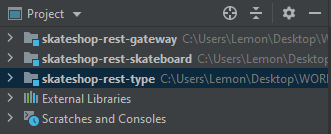
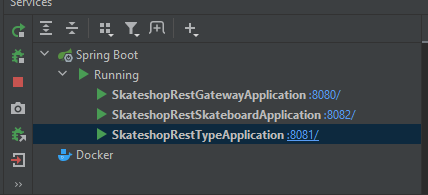
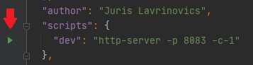
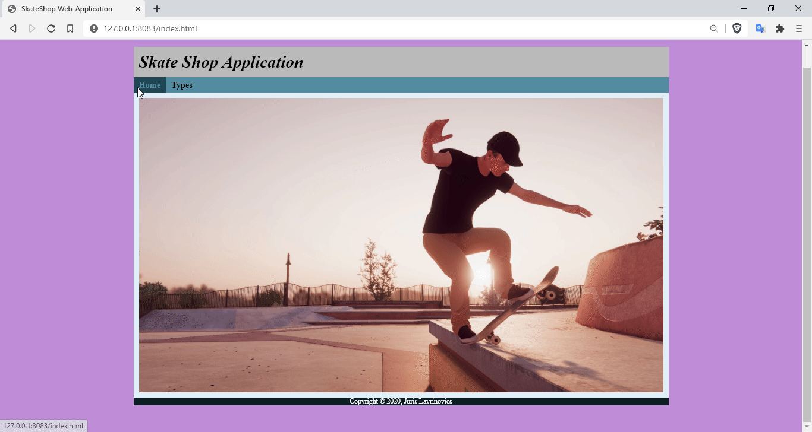

# SkateShop
SkateShop - Is a Spring Boot Application

## Table of contents
* [General info](#general-info)
* [Technologies](#technologies)
* [Setup](#setup)
* [View](#view)

## General info
SkateShop is an application based on microservices architecture. </br>
Back-end part of the application contains stand-alone modules.</br>
There are three REST-API services: 
* rest-gateway
* rest-skateboard
* rest-type

The front-end part is written to visualize how we can interact through the HTTP requests with the microservices. </br>
We can list all types of skateboards, delete and edit selected types. </br>
We can also view the list of skateboards of a specific type, add new skateboards, delete, edit and see more information as we do with types. </br>

## Technologies
[Back-end]
* Java: v11
* Maven: v4.0.0
* Lombok: v1.18.12
* Spring Boot: v2.3.4.RELEASE

[Front-end]
* JavaScript
* HTML3 and CSS
* Node.js: v14.15.1
	
## Setup
To start an application, firstly you need to run all three microservices.
You can do it in IntelliJ IDEA, by adding all three projects as modules. And then build and run each module independently. </br>
(the order in which executable files are run matters, start with a gateway, then rest-skateboard and the last one rest-type) </br>
Each module will run on a different port.

 </br>
 </br>

Secondly, you need to run the front-end part of an application.
Open new project with front-end files in a separate window of IntelliJ IDEA.
In console write this command:
```
npm install
```
And then
```
http-server -p 8083 -c-1
```

Or just click run button in the IDE. </br>
 </br>

This command will start the server on port:8083</br>
So you can open your browser and type localhost:8083
The website will load and you can see the start page.

## View
 </br>
